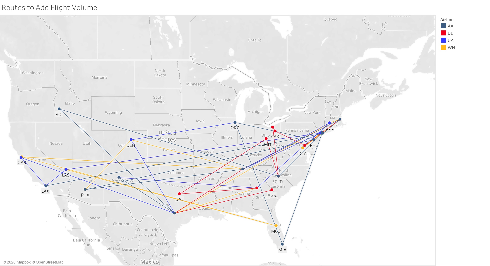
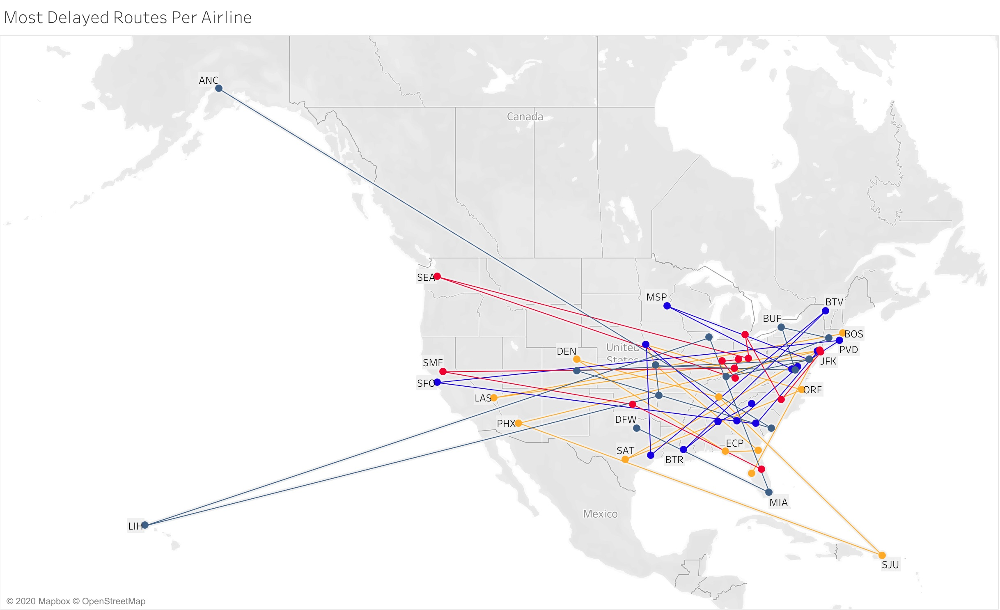

# Airline_Delay_Viz
Analyzed US domestic delay data to identify most delayed routes and recommend increased capacity using PySpark

Used PySpark through Databricks to analyse free data from the DOT to find most delayed routes (by a combination of arrival and destination delay) and routes for airlines to add flight volume (as a function of where a given airline already flies and has the lowest total delay)
Used Tableau to visualize all of the outputs from PySpark 

Instructions

1. Download data from: https://www.transtats.bts.gov/Fields.asp
2. Airport Location Data: airports.dat copy.txt (https://raw.githubusercontent.com/jpatokal/openflights/master/data/airports.dat)
3. Upload Carriers.csv and Airline.csv into Databricks 

Client Case 2 – Airline Route Management  
1. Run DBMProj_DataYearCombo.ipynb to combine 37 downloaded CSVs into Yearly data
2. Run Thiru.dbc to combine those 4 years into one CSV and get the Most Delayed Routes & Flight Volume Recommendations for the airlines 
    
Airline On-Time Performance Data Project Proposal

Matt Zlotnik, Arjun Rao, Namita Ramesh. Thiru Vinayagam, Prathik Ullur 

We have decided to work on the airline flight carrier on-time performance data set found here. We believe we could create a very interesting project in which we use the data available to predict airplane cancellations or (most likely more difficult) airplane delays on certain routes. As all of this information is publicly available, and all live flight information is similarly publicly available, We think we could leverage this data to have airlines aggressively market on highly contested routes (city-to-city connections in which many airlines fly) when both they and other airlines experience delays. For example, if we are able to get a solid fundamental prediction on when a flight might be delayed, then we could send customers who we know to have flown that route promotional material which both warns them that their flight could be delayed and that offers a discount on our airline’s flights on that route, including an option for the same day that the customer’s flight gets cancelled if they are flying with another airline. Essentially, knowing if a certain route is very delayed on Tuesday for example we could send promotions to the consumer lowering prices on other times on Tuesday or another day to help relieve congestion on that one day. 

The data we have has the following important attributes: the reporting airline, the airline IATA code, the origin and destination airports, and the delay of both take-off and landing. 

The final part of the project is to create an app through shiny that given an origin and destination airport would return the carrier with the least delays historically on that route, or given an origin airport and a carrier would give the day which has the least delays. 

